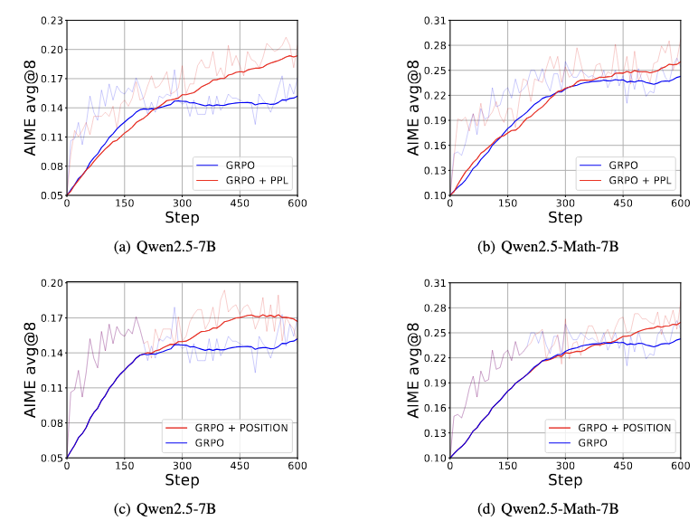

<div align="center">
<h1>From Trial-and-Error to Improvement: A Systematic Analysis of LLM Exploration Mechanisms in RLVR</h1>
<a href="https://arxiv.org/abs/2508.07534" target="_blank">
    
</a>
</div>

## Introduction

We conduct a comprehensive study on LLM exploration mechanisms in RLVR, aiming to quantify, characterize, and optimize how large language models explore solution spaces during complex problem-solving.
 
- 🔍 **Core Focus & Analysis**: We conduct a systematic analysis of the exploration capabilities of large language models (LLMs), examining key aspects such as the quantification of exploration boundaries, the interplay between entropy and performance, and strategies for enhancing data efficiency in reinforcement learning. Additionally, we compare the exploration behaviors of supervised fine-tuning (SFT) models, reinforcement learning (RL) models, and tool-integrated configurations, shedding light on their respective impacts on the breadth and efficiency of exploration.
  
- 🧠 **Key Findings**:
  - SFT expands exploration boundaries, while RL sharpens single-attempt accuracy but constricts exploration scope.
  - entropy-performance during RL dynamics shift with training stages (rising stage curbs errors to form reasoning patterns, plateau stage refines high-entropy key tokens), instance quality (low-PPL samples enable more robust learning), and token positions (later tokens exert greater influence on outcomes).
  - RFT maintains exploration capacity through controlled noisy data injection and prioritization of high-entropy, high-branching-factor samples.
- 🚀 **Strategies**: We introduce PPL- and position-aware advantage shaping techniques to boost the training efficiency of rollout data in the RL process.

<p align="center">
  
</p>

## Quick Start

### Environment Setup
```
pip install torch==2.6.0 --index-url https://download.pytorch.org/whl/cu124
pip install flash-attn --no-build-isolation
cd verl
pip install -e .
pip install vllm==0.8.5
pip install tensordict==0.6.2
```
